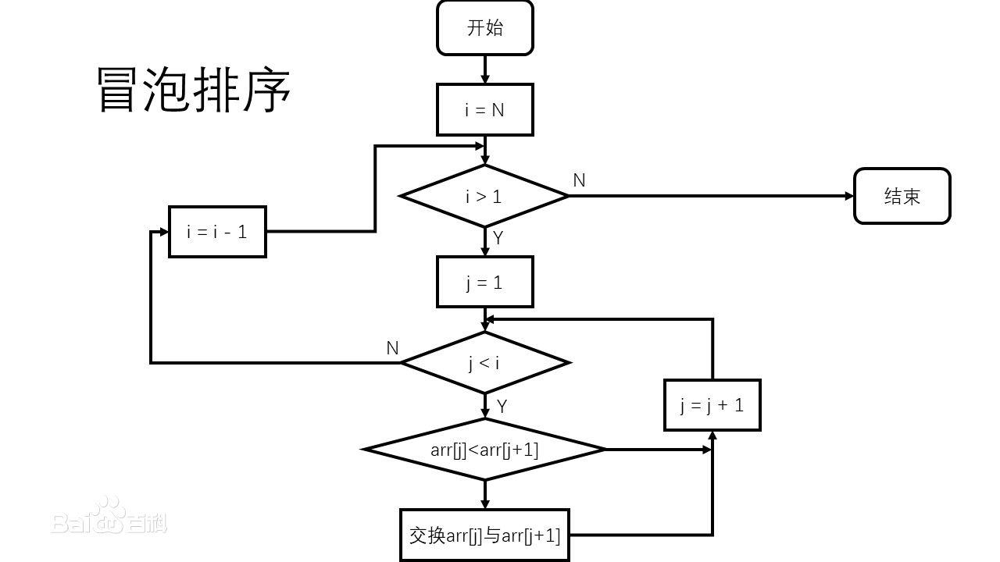
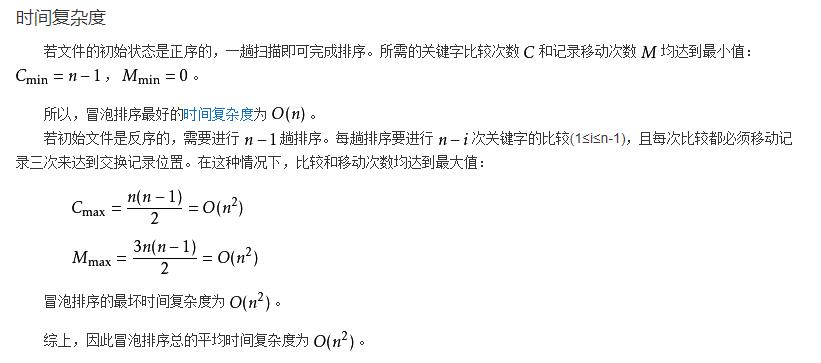

# 冒泡排序算法
冒泡排序是一种简单的排序算法。

## 流程图


## 时间复杂度
```text
不会用IEDA写markdown公式，以后修改 @TODO
```


## 算法稳定性
```text
冒泡排序就是把小的元素往前调或者把大的元素往后调。比较是相邻的两个元素比较，交换也发生在这两个元素之间。所以，如果两个元素相等，是不会再交换的；如果两个相等的元素没有相邻，那么即使通过前面的两两交换把两个相邻起来，这时候也不会交换，所以相同元素的前后顺序并没有改变，所以冒泡排序是一种稳定排序算法。
```

### Java
```java
public class Test {
    /**
     * 冒泡排序
     * 比较相邻的元素。如果第一个比第二个大，就交换他们两个。  
     * 对每一对相邻元素作同样的工作，从开始第一对到结尾的最后一对。在这一点，最后的元素应该会是最大的数。  
     * 针对所有的元素重复以上的步骤，除了最后一个。
     * 持续每次对越来越少的元素重复上面的步骤，直到没有任何一对数字需要比较。 
     * @param numbers 需要排序的整型数组
     */
	public static void bubbleSort(int[] numbers) {
		int temp = 0;
		int size = numbers.length;
		for (int i = 0; i < size - 1; i++) {
			for (int j = 0; j < size - 1 - i; j++) {
				if (numbers[j] > numbers[j + 1]) // 交换两数位置
				{
					temp = numbers[j];
					numbers[j] = numbers[j + 1];
					numbers[j + 1] = temp;
				}
			}
		}
	}
}
```