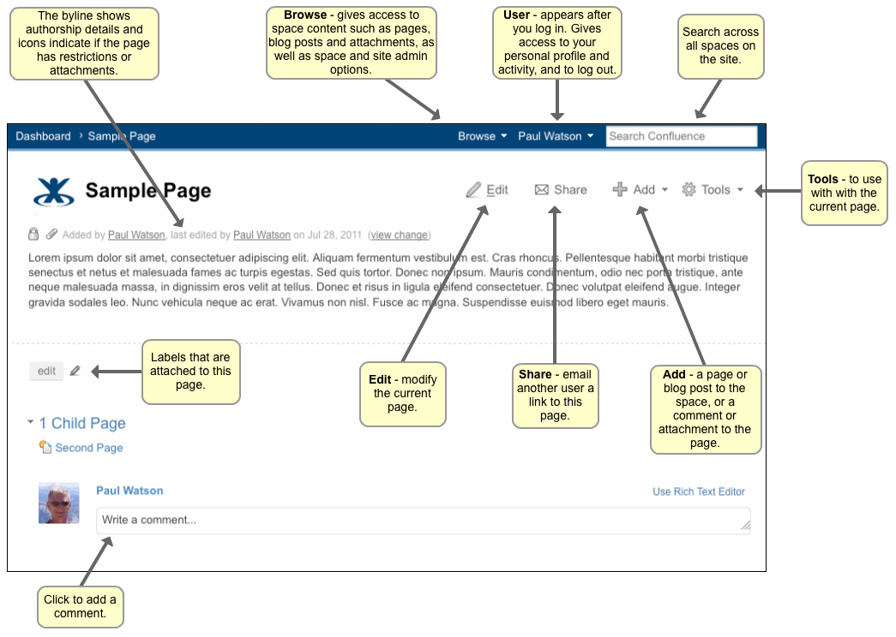

# confluence 团队协作软件


- [confluence官网](https://www.atlassian.com/software/confluence)
- [confluence下载地址](https://www.atlassian.com/software/confluence/download-archives)
- [confluence演示空间-学习教程](http://www.confluence.cn/pages/viewpage.action?pageId=360473)
```text
Create, collaborate, and keep all your work in one place

Unlike document and file-sharing tools, Confluence is open and accessible, helping your 
team, and your company do their best work together

```
### 用途:
- 技术博客
- 发送文章
- 评论，点赞
- 作为公司内部的团队协作软件
- 在线编辑Word Excel PPT等

### 学习使用
1. 面板 Dashboard
    - **欢迎信息** Confluence管理员能够使用管理控制台定制欢迎信息
    - **空间、页面、网络** 显示最喜欢的内容和人的选项卡
    - **最近的活动** 显示所有空间中最近更新内容的选项卡
2.  菜单 
    
    菜单 | 说明
    ---|---
    Browse（浏览） | 提供wiki内容（例如页面、博文帖等）访问权限，并使您能够浏览人员目录。如果您是一位管理员，这里也会显示空间和站点管理选项。
    User（用户） | 在您登录以后，您的姓名将会显示在屏幕的右上角。这就是“用户”菜单，而且使您能注销、访问您的配置文件，或者浏览您的编辑历史、个人标签和页面Watch。<br> 您也能暂存正在的编辑的页面草稿。
    Search（查找） | 在框中键入并按“回车”来查找。
    Edit（编辑） | 编辑当前页面（或按“E”）
    Share（分享） | 将当前页面的链接通过电子邮件发送给另一个Confluence用户。
    Add（添加） |  在一个页面上添加内容，或者在空间中添加一个新的页面或博文
    Tools（工具） | 同这个页面相关的杂项活动。
    Byline（署名） | 显示谁最初创建，以及谁最近编辑了这个页面。
    Byline Icons（署名图标） | 一个小挂锁图表说明了页面限制。一个回形针图标说明这个页面有附件。这两个图标都能点击，分别指向“页面信息”和“附件”页面。
    Labels（标签）| 显示附加到当前页面的标签（或标记）。（或者按“L“）
    Add a Comment（添加一条评论） | 在文本框中点击，开始写一条评论。（或按“M”）


