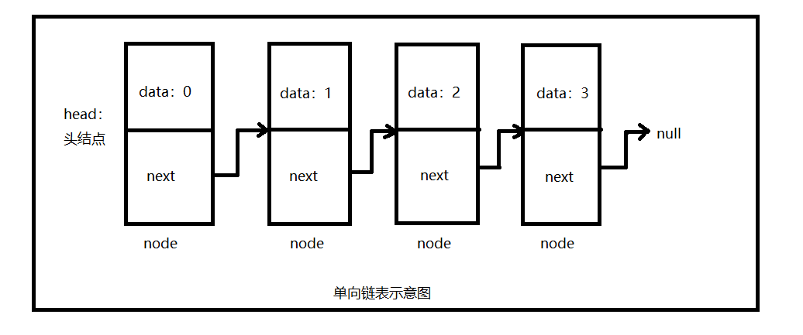
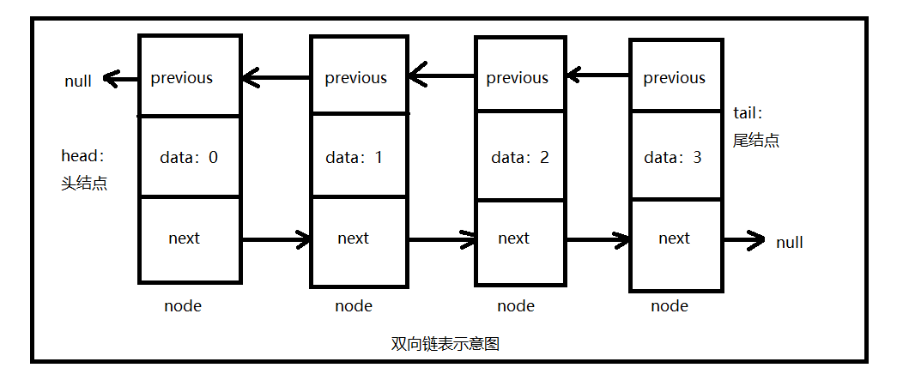

# 数据结构-链表
 数据的存储一般分线性存储结构和链式存储结构两种。前者是一种顺序的存储方式，在内存中用一块连续的内存空间存储数据，即逻辑上相连的物理位置相邻，比较常见的就是数组；后者是一种链式存储方式，不保证顺序性，逻辑上相邻的元素之间用指针所指定，它不是用一块连续的内存存储，逻辑上相连的物理位置不一定相邻。本篇主要介绍链式存储结构基于链表的实现，使用的语言为Java。
 链表是一种递归的数据结构，它要么为空（null），要么指向是指向一个结点（node）的引用，该节点含有一个泛型元素（该泛型元素可以是任意数据类型），和一个指向另一个链表的引用。链表有很多种，下面主要介绍单向链表、双端链表、有序链表、双向链表。
    


单向链表：单向链表是最简单、最基础的链表，它的一个结点（node）分两部分，第一部分存储结点的数据信息（data），第二部分存储指向下一结点的地址（next）信息。最后一个结点（链尾）指向一个空地址（null）。单向链表一般只在链表表头（链头）结点的位置插入元素，这样每次新加入的元素都会在链头位置，而最先加入的元素会在链尾位置。删除操作时，如果在链头位置删除，只需要把头结点指向其下一个结点即可；如果是在中间位置删除，只需要将其前一个结点指向其下一个结点即可。单向链表示意图如下图所示：
    


单向链表的Java代码实现：
```java
import java.util.Stack;
public class LinkedListOnePoint {
    private Node head;  //头结点
    private int size;  //链表长度，即链表中结点数量
    
    public LinkedListOnePoint(){
        head = null;
        size = 0;
    }
    
    //私有内部类，代表链表每个结点
    private class Node{
        private Object data;  //链表结点的值
        private Node next;  //指向的下一个结点
        public Node(Object data){
            this.data = data;
        }
    }
    
    //判断链表是否为空
    public boolean isEmpty(){
        return size==0?true:false;
    }
    
    //返回链表长度
    public int size(){
        return size;
    }
    
    //查看链表头结点，不移除
    public Object headNode(){
        if(size == 0) return null;
        return head.data;
    }
    
    //在链表表头插入一个结点（入栈）
    public void insertInHead(Object obj){
        Node newNode = new Node(obj);
        if(size == 0){
            head = newNode;
        }else{
            newNode.next = head;
            head = newNode;
        }
        size++;
    }
    
    //删除链表表头结点（出栈）
    public Object deleteHeadNode(){
        if(size == 0) return null;
        Object obj = head.data;
        if(head.next == null){
            head = null;  //只有一个结点
        }else{
            head = head.next;
        }
        size--;
        return obj;
    }
    
    //链表查找：判断链表中是否包含某个元素
    public boolean containObject(Object obj){
        if(size == 0) return false;
        Node n = head;
        while(n != null){
            if(n.data == obj) return true;
            else n = n.next;
        }
        return false;
    }
    
    //删除链表中的指定结点（如果包含多个指定结点，只会删除第一个）
    public boolean deleteNode(Object obj){
        if(size == 0){
            System.out.println("链表为空！");
            return false;
        }
        //先在链表中查询是否包含该结点，找到之后获取该结点和其前一个结点
        Node previous = null;  //前一个结点
        Node current = head;  //当前结点
        while(current.data != obj){
            if(current.next == null){
                System.out.println("没有找到该结点！");
                return false;
            }
            previous = current;
            current = current.next;
        }
        if(current == head){
            this.deleteHeadNode();
        }else{
            previous.next = current.next;
            size--;
        }
        return true;
    }
    
    //正向打印链表
    public void display(){
        if(size == 0) System.out.println("链表为空！");
        Node n = head;
        while(n != null){
            System.out.print("<-"+n.data);
            n = n.next;
        }
        System.out.println();
    }
    
    //反向打印链表（用栈）
    public void printListFromTailToHead(Node node){
        if(node == null) System.out.println("链表为空！");
        Stack<Integer> sta = new Stack<Integer>();
        while(node != null){
            sta.push((Integer) node.data);  //先将链表压入栈中
            node = node.next;
        }
        while(!sta.empty()){
            System.out.print(sta.pop()+"<-");  //出栈
        }
        System.out.println();
    }
    
    //反向打印链表（递归）
    public void printListFromTailToHeadDiGui(Node node){
        if(node == null){
            System.out.println("链表为空！");
        }else{
            if(node.next != null){
                printListFromTailToHeadDiGui(node.next);
            }
            System.out.print(node.data+"<-");
        }
    }
    
    
    public static void main(String[] args) {
        LinkedListOnePoint list = new LinkedListOnePoint();
        System.out.println(list.isEmpty());            //true
        System.out.println(list.size());               //0
        list.display();                                //链表为空！
        list.printListFromTailToHead(list.head);       //链表为空！
        
        list.insertInHead(0);
        list.insertInHead(1);
        list.insertInHead(2);
        list.insertInHead(3);        
        list.display();                                //<-3<-2<-1<-0
        list.printListFromTailToHead(list.head);       //0<-1<-2<-3<-
        list.printListFromTailToHeadDiGui(list.head);  //0<-1<-2<-3<-
        System.out.println(list.isEmpty());            //false
        System.out.println(list.size());               //4
        System.out.println(list.containObject(1));     //true
    }
}
```
我们知道，栈是一种“后进先出”的数据结构，对栈的插入和删除操作都是在栈头位置进行的，这与在单向链表的表头插入和删除元素的原理类似，因此可以用单向链表实现栈。

单向链表实现栈的Java代码：	
```java
/*
 * 单链表实现栈
 */
public class LinkedListToStack {
    private LinkedListOnePoint linkedlist;
    
    public LinkedListToStack(){
        linkedlist = new LinkedListOnePoint();
    }

    //栈大小
    public int size(){
        return linkedlist.size();
    }
    
    //是否为空栈
    public boolean isEmpty(){
        return linkedlist.isEmpty();
    }
    
    //入栈
    public void push(Object obj){
        linkedlist.insertInHead(obj);
    }
    
    //出栈
    public Object pop(){
        if(this.isEmpty()) return null;
        return linkedlist.deleteHeadNode();
    }
    
    //查看栈顶元素
    public Object peek(){
        if(this.isEmpty()) return null;
        return linkedlist.headNode();
    }
    
    //打印栈中元素
    public void display(){
        linkedlist.display();
    }
    
    public static void main(String[] args) {
        LinkedListToStack stack = new LinkedListToStack();
        stack.push(0);
        stack.push(1);
        stack.push(2);
        stack.push(3);
        stack.display();     //<-3<-2<-1<-0
        System.out.println(stack.peek()); //3
        System.out.println(stack.pop());  //3
        System.out.println(stack.pop());  //2
        System.out.println(stack.pop());  //1
        System.out.println(stack.pop());  //0
        System.out.println(stack.pop());  //null
    }
}
```

双端链表：双端链表和单向链表大体上是一样的，不同的是，单向链表在表尾部分插入元素时，需要从头结点一直遍历到尾结点才能进行插入操作，这样难免有些繁琐。因此如果加入一个对尾结点的引用，这样就可以很方便地在尾结点进行插入操作，这就是双端链表。除了有一个头结点（head），还有一个尾结点（tail）。注意它和后面双向链表的区别！


双端链表的Java代码实现: 
```java
import java.util.Stack;

/*
 * 双端链表，比单链表多了个尾结点
 */
public class LinkedListTwoPoint {
    private Node head;  //头结点
    private Node tail;  //尾结点
    private int size;  //链表长度，即链表中结点数量
    
    public LinkedListTwoPoint(){
        head = null;  //头结点
        tail = null;  //尾结点
        size = 0;  //链表长度，即链表中结点数量
    }
    
    //私有内部类，代表链表每个结点
    private class Node{
        private Object data;  //链表结点的值
        private Node next;  //指向的下一个结点
        public Node(Object data){
            this.data = data;
        }
    }
    
    //判断链表是否为空
    public boolean isEmpty(){
        return size==0?true:false;
    }
    
    //返回链表长度
    public int size(){
        return size;
    }
    
    //查看链表头结点，不移除
    public Object headNode(){
        if(size == 0) return null;
        return head.data;
    }
    
    //查看链表尾结点，不移除
    public Object tailNode(){
        if(size == 0) return null;
        return tail.data;
    }
    
    //在链表表头插入一个结点
    public void insertInHead(Object obj){
        Node newNode = new Node(obj);
        if(size == 0){
            head = newNode;
            tail = newNode;
        }else{
            newNode.next = head;
            head = newNode;
        }
        size++;
    }
    //在链表表尾插入一个结点
    public void insertInTail(Object obj){
        Node newNode = new Node(obj);
        if(size == 0){
            head = newNode;
            tail = newNode;
        }else{
            tail.next = newNode;
            tail = newNode;
        }
        size++;
    }
    
    //删除链表表头结点
    public Object deleteHeadNode(){
        if(size == 0) return null;
        Object obj = head.data;
        if(head.next == null){  //只有一个结点
            head = null;
            tail = null;
        }else{
            head = head.next;
        }
        size--;
        return obj;
    }
    
    //链表查找：判断链表中是否包含某个元素
    public boolean containObject(Object obj){
        if(size == 0) return false;
        Node n = head;
        while(n != null){
            if(n.data == obj) return true;
            else n = n.next;
        }
        return false;
    }
    
    //删除链表中的指定结点（如果包含多个指定结点，只会删除第一个）
    public boolean deleteNode(Object obj){
        if(size == 0){
            System.out.println("链表为空！");
            return false;
        }
        //先在链表中查询是否包含该结点，找到之后获取该结点和其前一个结点
        Node previous = null;  //前一个结点
        Node current = head;  //当前结点
        while(current.data != obj){
            if(current.next == null){
                System.out.println("没有找到该结点！");
                return false;
            }
            previous = current;
            current = current.next;
        }
        if(current == head){
            this.deleteHeadNode();
        }else{
            previous.next = current.next;
            size--;
        }
        return true;
    }
    
    //正向打印链表
    public void display(){
        if(size == 0) System.out.println("链表为空！");
        Node n = head;
        while(n != null){
            System.out.print(n.data + "<-");
            n = n.next;
        }
        System.out.println();
    }
    
    //反向打印链表（用栈）
    public void printListFromTailToHead(Node node){
        if(node == null) System.out.println("链表为空！");
        Stack<Integer> sta = new Stack<Integer>();
        while(node != null){
            sta.push((Integer) node.data);  //先将链表压入栈中
            node = node.next;
        }
        while(!sta.empty()){
            System.out.print(sta.pop()+"<-");  //出栈
        }
        System.out.println();
    }
    
    //反向打印链表（递归）
    public void printListFromTailToHeadDiGui(Node node){
        if(node == null){
            System.out.println("链表为空！");
        }else{
            if(node.next != null){
                printListFromTailToHeadDiGui(node.next);
            }
            System.out.print(node.data+"<-");
        }
    }
    
    
    public static void main(String[] args) {
        LinkedListTwoPoint list = new LinkedListTwoPoint();
        System.out.println(list.isEmpty());            //true
        System.out.println(list.size());               //0
        list.display();                                //链表为空！
        list.printListFromTailToHead(list.head);       //链表为空！
        
        list.insertInHead(0);
        list.insertInHead(1);
        list.insertInHead(2);
        list.insertInHead(3);        
        list.display();                                //3<-2<-1<-0<-
        list.printListFromTailToHead(list.head);       //0<-1<-2<-3<-
        list.printListFromTailToHeadDiGui(list.head);  //0<-1<-2<-3<-
        System.out.println(list.isEmpty());            //false
        System.out.println(list.size());               //4
        System.out.println(list.containObject(1));     //true
    }
}
```

我们知道，队列是一种“先进先出”的数据结构，队列的插入操作是在队尾进行的，而删除操作是在队头进行的，这与在双端链表的表尾插入和在表头删除操作是类似的，因此可以用双端链表实现队列。
双端链表实现队列的Java代码：

```java
/*
 * 双端链表实现队列
 */
public class LinkedListToQueue {
    private LinkedListTwoPoint linkedlist;
    
    public LinkedListToQueue(){
        linkedlist = new LinkedListTwoPoint();
    }

    //队列大小
    public int size(){
        return linkedlist.size();
    }
    
    //是否为空队列
    public boolean isEmpty(){
        return linkedlist.isEmpty();
    }
    
    //入列，在链表表尾插入节点
    public void add(Object obj){
        linkedlist.insertInTail(obj);
    }
    
    //出列，在链表表头删除结点
    public Object poll(){
        if(this.isEmpty()) return null;
        return linkedlist.deleteHeadNode();
    }
    
    //查看队列头元素
    public Object peekHead(){
        if(this.isEmpty()) return null;
        return linkedlist.headNode();
    }
    
    //查看队列尾元素
    public Object peekTail(){
        if(this.isEmpty()) return null;
        return linkedlist.tailNode();
    }
    
    //打印队列元素
    public void display(){
        linkedlist.display();
    }
    
    public static void main(String[] args) {
        LinkedListToQueue stack = new LinkedListToQueue();
        stack.add(0);
        stack.add(1);
        stack.add(2);
        stack.add(3);
        stack.display();     //0<-1<-2<-3<-
        System.out.println(stack.peekHead()); //0
        System.out.println(stack.peekTail()); //3
        System.out.println(stack.poll());  //0
        System.out.println(stack.poll());  //1
        System.out.println(stack.poll());  //2
        System.out.println(stack.poll());  //3
        System.out.println(stack.poll());  //null
    }
}
```

**有序链表**：链表本身是一种无序的数据结构，元素的插入和删除不能保证顺序性，但是有没有有序的链表呢？答案是肯定的，我们在单向链表中插入元素时，只需要将插入的元素与头结点及其后面的结点比较，从而找到合适的位置插入即可。一般在大多数需要使用有序数组的场合也可以使用有序链表，有序链表在插入时因为不需要移动元素，因此插入速度比数组快很多，另外链表可以扩展到全部有效的使用内存，而数组只能局限于一个固定的大小中。
有序链表的Java代码实现：
```java
/*
 * 有序链表
 */
public class LinkedListInOrder {
    private Node head;  //头结点
    private int size;  //链表长度，即链表中结点数量
    
    public LinkedListInOrder(){
        head = null;
        size = 0;
    }
    
    //私有内部类，代表链表每个结点
    private class Node{
        private Integer data;  //链表结点的值
        private Node next;  //指向的下一个结点
        public Node(Integer data){
            this.data = data;
        }
    }
    
    //判断链表是否为空
    public boolean isEmpty(){
        return size==0?true:false;
    }
    
    //返回链表长度
    public int size(){
        return size;
    }
    
    //在链表中插入一个结点，保持链表有序性（头结点最小，尾结点最大）
    public void insertNode(Integer obj){
        Node newNode = new Node(obj);
        if(size == 0){  //空链表直接放入头结点
            head = newNode;
        }else{
            Node previous = null;  //插入位置前一个结点
            Node current = head;  //插入位置后一个结点（当前结点）
            while(current.data<obj && current.next != null){  //找到插入位置
                 previous = current;
                 current = current.next;
            }
            if(current.next == null){  //如果插入的结点大于链表中所有结点，则放到链尾
                 current.next = newNode;
            }else{
                previous.next = newNode;  //在合适位置插入
                newNode.next = current; 
            }
        }
        size++;
    }
    
    //删除链表表头结点
    public Object deleteHeadNode(){
        if(size == 0) return null;
        Object obj = head.data;
        if(head.next == null){
            head = null;  //只有一个结点
        }else{
            head = head.next;
        }
        size--;
        return obj;
    }
    
    //正向打印链表
    public void display(){
        if(size == 0) System.out.println("链表为空！");
        Node n = head;
        while(n != null){
            System.out.print("<-"+n.data);
            n = n.next;
        }
        System.out.println();
    }
    
    public static void main(String[] args) {
        LinkedListInOrder list = new LinkedListInOrder();
        System.out.println(list.isEmpty());            //true
        System.out.println(list.size());               //0
        list.display();                                //链表为空！
        
        list.insertNode(0);
        list.insertNode(1);
        list.insertNode(2);
        list.insertNode(3);
        list.insertNode(2);
        list.insertNode(4);
        list.display();                                //<-0<-1<-2<-2<-3<-4
        System.out.println(list.isEmpty());            //false
        System.out.println(list.size());               //6
        System.out.println("*****************************");
        
    }
}
```

双向链表：前面的几种链表只能从头结点遍历到尾结点这一个方向，每个结点都只能指向其下一个结点。而双向链表的每个结点既能指向下一个结点，又能指向前一个结点，双向链表既能从头结点向尾结点遍历，又能从尾结点向头结点遍历，既有一个头结点，又有一个尾结点。

双向链表的Java代码实现：
```java
/*
 * 双向链表
 * 单向链表只可向一个方向遍历，一般查找一个结点的时候需要从第一个结点开始每次访问下一个结点，一直访问到需要的位置。
 * 双向链表的每个结点都有指向的前一个结点和后一个节点，既有链表表头又有表尾，即可从链头向链尾遍历，又可从链尾向链头遍历。
 * LinkedList中的私有静态内部类Node实际上就是一个双向链表，<E>代表泛型，指明结点的数据类型
 * private static class Node<E> {
        E item;
        Node<E> next;
        Node<E> prev;

        Node(Node<E> prev, E element, Node<E> next) {
            this.item = element;
            this.next = next;
            this.prev = prev;
        }
    }
 */
public class LinkedListTwoDirections {
    private Node head;  //头结点
    private Node tail;  //尾结点
    private int size;  //链表长度，即链表中结点数量
    
    public LinkedListTwoDirections(){
        head = null;
        tail = null;
        size = 0;
    }
    
    //私有内部类，代表链表每个结点
    private class Node{
        private Object data;    //链表结点的值
        private Node previous;  //当前结点指向的前一个结点
        private Node next;      //当前结点指向的下一个结点
        public Node(Object data){
            this.data = data;
        }
    }
    
    //判断链表是否为空
    public boolean isEmpty(){
        return size==0?true:false;
    }
    
    //返回链表长度
    public int size(){
        return size;
    }
    
    //查看链表头结点，不移除
    public Object headNode(){
        if(size == 0) return null;
        return head.data;
    }
    
    //查看链表尾结点，不移除
    public Object tailNode(){
        if(size == 0) return null;
        return tail.data;
    }
    
    //在链表表头插入一个结点
    public void insertInHead(Object obj){
        Node newNode = new Node(obj);
        if(size == 0){
            head = newNode;
            tail = newNode;
        }else{
            newNode.next = head;
            head.previous = newNode;
            head = newNode;
        }
        size++;
    }
    
    //在链表表尾插入一个结点
    public void insertInTail(Object obj){
        Node newNode = new Node(obj);
        if(size == 0){
            head = newNode;
            tail = newNode;
        }else{
            newNode.previous = tail;
            tail.next = newNode;
            tail = newNode;
        }
        size++;
    }
    
    //删除链表表头结点
    public Object deleteHeadNode(){
        if(size == 0) return null;
        Object obj = head.data;
        if(head.next == null){  //只有一个结点
            head = null;
            tail = null;
        }else{
            head = head.next;
            head.previous = null;
        }
        size--;
        return obj;
    }
    
    //删除链表表尾结点
    public Object deleteTailNode(){
        if(size == 0) return null;
        Object obj = tail.data;
        if(tail.previous == null){  //只有一个结点
            head = null;
            tail = null;
        }else{
            tail = tail.previous;
            tail.next = null;
        }
        size--;
        return obj;
    }
    
    //正向打印链表
    public void display(){
        if(size == 0) System.out.println("链表为空！");
        Node n = head;
        while(n != null){
            System.out.print("<-"+n.data);
            n = n.next;
        }
        System.out.println();
    }
    
    public static void main(String[] args) {
        LinkedListTwoDirections list = new LinkedListTwoDirections();
        System.out.println(list.isEmpty());            //true
        System.out.println(list.size());               //0
        list.display();                                //链表为空！
        
        list.insertInHead(0);
        list.insertInHead(1);
        list.insertInHead(2);
        list.insertInHead(3);        
        list.display();                                //<-3<-2<-1<-0
        System.out.println(list.deleteHeadNode());     //3
        
        list.insertInTail(1);
        list.insertInTail(2);
        list.display();                                //<-2<-1<-0<-1<-2
        
    }
}
```
出处： http://www.cnblogs.com/Y-oung/p/8886142.html
