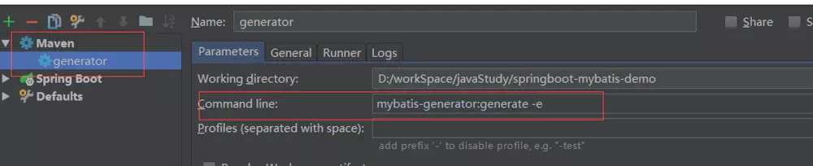
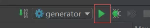

# IDEA 插件的使用

## MyBatis Generator
```text
    在IDEA中使用 MyBatis Generator生成实体类和mapper配置文件
```
### 1. pom.xml 文件的build节点
```xml
<!-- mybatis generator 自动生成代码插件 -->
  <plugin>
    <groupId>org.mybatis.generator</groupId>
    <artifactId>mybatis-generator-maven-plugin</artifactId>
    <version>1.3.5</version>
    <configuration>
      <!--配置文件的位置-->
      <configurationFile>src/main/resources/generatorConfig.xml</configurationFile>
      <overwrite>true</overwrite>
      <verbose>true</verbose>
    </configuration>
  </plugin>
```

### 2. resources目录新建 generatorConfig.xml
```xml
<?xml version="1.0" encoding="UTF-8"?>
<!DOCTYPE generatorConfiguration
 PUBLIC "-//mybatis.org//DTD MyBatis Generator Configuration 1.0//EN" 
 "http://mybatis.org/dtd/mybatis-generator-config_1_0.dtd">
<generatorConfiguration>
<!--mysql 连接数据库jar 这里选择自己本地位置-->
<classPathEntry location="C:\splanchnic\maven\mvnRespo\mysql\mysql-connector-java\5.1.44\mysql-connector-java-5.1.44.jar" />
<context id="testTables" targetRuntime="MyBatis3">
  <commentGenerator>
    <!-- 是否去除自动生成的注释 true：是 ： false:否 -->
    <property name="suppressAllComments" value="true" />
  </commentGenerator>
  <!--数据库连接的信息：驱动类、连接地址、用户名、密码 -->
  <jdbcConnection driverClass="com.mysql.jdbc.Driver" connectionURL="jdbc:mysql://localhost:3306/angus_oa" userId="root" password="123456"></jdbcConnection>
  <!-- 默认false，把JDBC DECIMAL 和 NUMERIC 类型解析为 Integer，为 true 时把JDBC DECIMAL 和 NUMERIC 类型解析为java.math.BigDecimal -->
  <javaTypeResolver>
    <property name="forceBigDecimals" value="false" />
  </javaTypeResolver>
  
  <!-- 生成模型(PO)的包名和位置 -->
  <javaModelGenerator targetPackage="com.angus.entity" targetProject="src/main/java">
    <!-- enableSubPackages:是否让schema作为包的后缀 -->
    <property name="enableSubPackages" value="false" />
    <!-- 从数据库返回的值被清理前后的空格 -->
    <property name="trimStrings" value="true" />
  </javaModelGenerator>
  
  <!-- 生成映射文件的包名和位置-->
  <sqlMapGenerator targetPackage="main.resources.mapping" targetProject="src">
    <!-- enableSubPackages:是否让schema作为包的后缀 -->
    <property name="enableSubPackages" value="false" />
  </sqlMapGenerator>
  
  <!-- 生成DAO的包名和位置-->
  <javaClientGenerator type="XMLMAPPER" targetPackage="com.angus.dao" targetProject="src/main/java">
    <!-- enableSubPackages:是否让schema作为包的后缀 -->
    <property name="enableSubPackages" value="false" />
  </javaClientGenerator>
  
  <!-- 要生成的表 tableName是数据库中的表名或视图名 domainObjectName是 实体类名-->
  <table tableName="t_user" domainObjectName="User" enableCountByExample="false" enableUpdateByExample="false" enableDeleteByExample="false" enableSelectByExample="false" selectByExampleQueryId="false"></table>
</context>
</generatorConfiguration>
```

### 3. 加入maven配置，在 Command line中加入 mybatis-generator:generate -e

### 4. 启动项目
