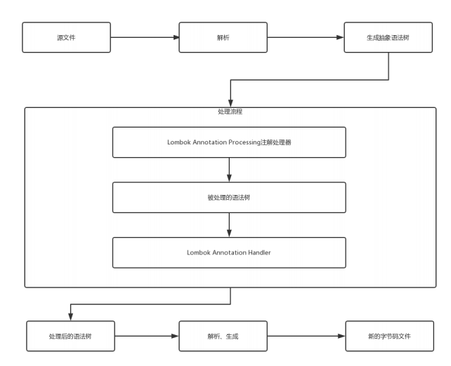

# Lombok

[官网](https://projectlombok.org)

[官方文档](https://projectlombok.org/features/index.html)

[Github地址](https://github.com/mplushnikov/lombok-intellij-plugin)

> 官网介绍： Project Lombok makes java a spicier language by adding 'handlers' that know how to build and compile simple, boilerplate-free, not-quite-java code.
大致意思是Lombok通过增加一些“处理程序”让代码更加简洁。

>Lombok 是一种 Java™ 实用工具。
 通过简单注解来精简代码达到消除冗长代码的目的，尤其是对于简单的 Java 对象（POJO）。
 
> Lombok 采取的注解形式的，在编译后，自动生成相应的方法
## 步骤
- 添加依赖
```text
    <!-- 在 pom.xml 文件中添加相关依赖 -->
    <!-- https://mvnrepository.com/artifact/org.projectlombok/lombok -->
    <dependencies>
    	<dependency>
    		<groupId>org.projectlombok</groupId>
    		<artifactId>lombok</artifactId>
    		<version>1.18.6</version>
    		<scope>provided</scope>
    	</dependency>
    </dependencies>
    
```

- 安装插件
>  为了IDE不报错，需要安装插件支持它

Add the Lombok IntelliJ plugin to add lombok support for IntelliJ:

```text
    Go to File > Settings > Plugins
    Click on Browse repositories...
    Search for Lombok Plugin
    Click on Install plugin
    Restart IntelliJ IDEA
```


## 常用的注解
https://projectlombok.org/features/all

```text
@Data
    注解在类上
    提供类所有属性的 getting 和 setting 方法，
    此外还提供了equals、canEqual、hashCode、toString 方法
    
    如果只是使用@Data注解生成getter setter，建议使用@Getter @Setter注解替换@Data注解。
        
@Setter
    注解在类或属性上
    为属性提供 setting 方法
    在使用该注解时，会默认生成一个无参构造 和 对应的setter方法。
@Getter
    注解在类或属性上
    为属性提供 getting 方法
    在使用该注解时，会默认生成一个无参构造 和 对应的getter方法。
@Slf4j
    在需要打印日志的类中使用，
    当项目中使用了slf4j打印日志框架时使用该注解，会简化日志的打印流程，
    直接调用log
@Log4j
    注解在类上
    为类提供一个 属性名为log 的 log4j 日志对象
@Log
    使用的是 java.util.logging.Logger
    直接使用 变量 log
@NoArgsConstructor
    注解在类上
    为类提供一个无参的构造方法
@AllArgsConstructor
    注解在类上
    为类提供一个全参的构造方法
    会生成一个包含所有变量，同时如果变量使用了NotNull annotation，会进行是否为空的校验， 
    全部参数的构造函数的自动生成，该注解的作用域也是只有在实体类上，参数的顺序与属性定义的顺序一致。
@Cleanup
    自动化关闭流，相当于 jdk1.7 种的 try with resource
@Builder
    被注解的类加个构造者模式
@Synchronized
    加个同步锁
@SneakyThrows
    等同于try/catch 捕获异常
@NonNull
    如果给参数加个这个注解 参数为null会抛出空指针异常。
    该注解会默认生成无参构造函数。
@RequiredArgsConstructor
    会生成一个包含常量（final），和标识了@NotNull的变量的构造方法。
@Value
    注解和@Data类似，
    区别在于它会把所有成员变量默认定义为private final修饰，并且不会生成set方法。
@toString
    注解在类上
    为类提供toString方法（可以添加排除和依赖）
@ToString(exclude="column")
    排除column列所对应的元素
    即在生成toString方法时不包含column参数
@ToString(exclude={"column1","column2"})
    排除多个column列所对应的元素，
    其中间用英文状态下的逗号进行分割，
    即在生成toString方法时不包含多个column参数
@ToString(of="column")
    只生成包含column列所对应的元素的参数的toString方法，
    即在生成toString方法时只包含column参数
@ToString(of={"column1","column2"})
    只生成包含多个column列所对应的元素的参数的toString方法，
    其中间用英文状态下的逗号进行分割，
    即在生成toString方法时只包含多个column参数
@EqualsAndHashCode
    在JavaBean或类JavaBean中使用，
    使用此注解会自动重写对应的equals方法和hashCode方法
    
@Builder
    bulder 模式构建对象
```

### 注解详情示例

#### @Log
> 官网说明文档：https://projectlombok.org/features/log

> 注解在类上。默认情况下，记录器的主题（或名称）将是使用注释进行@Log注释的类的类名称。这可以通过指定topic参数来定制。例如：@XSlf4j(topic="reporting")。

> 这是一个泛型注解，具体有多种形式：
```text
//@CommonsLog
private static final org.apache.commons.logging.Log log = org.apache.commons.logging.LogFactory.getLog(LogExample.class);
//@JBossLog
private static final org.jboss.logging.Logger log = org.jboss.logging.Logger.getLogger(LogExample.class);
//@Log
private static final java.util.logging.Logger log = java.util.logging.Logger.getLogger(LogExample.class.getName());
//@Log4j
private static final org.apache.log4j.Logger log = org.apache.log4j.Logger.getLogger(LogExample.class);
//@Log4j2
private static final org.apache.logging.log4j.Logger log = org.apache.logging.log4j.LogManager.getLogger(LogExample.class);
//@Slf4j
private static final org.slf4j.Logger log = org.slf4j.LoggerFactory.getLogger(LogExample.class);
//@XSlf4j
private static final org.slf4j.ext.XLogger log = org.slf4j.ext.XLoggerFactory.getXLogger(LogExample.class);

```


#### @Cleanup
自动化关闭流，相当于 jdk1.7 种的 try with resource
```text
@Cleanup 
InputStream in = new FileInputStream(args[0]);
@Cleanup 
OutputStream out = new FileOutputStream(args[1]);
```

#### @NonNull
```text
public NonNullExample(@NonNull Person person) {
    this.name = person.getName();
}
转换后：
public NonNullExample(@NonNull Person person) {
    if (person == null) {
        throw new NullPointerException("person");
    }
    this.name = person.getName();
}
```
#### @SneakyThrows
暗中抛出异常，当我们需要抛出异常，在当前方法上调用，不用显示的在方法名后面写 throw
```text
@SneakyThrows(Exception.class)
```
#### @Synchronized
>方法中所有的代码都加入到一个代码块中，默认静态方法使用的是全局锁，普通方法使用的是对象锁，当然也可以指定锁的对象。
```text
private final Object lock = new Object();
@Synchronized("lock")
public void foo() {
    // Do something
}
```

## Lombok运行原理
```text
    源代码文件（source）
    编译（parse）
    抽象语法树（AST）
    注解编译期
    自动编译匹配（Modified AST）
```
>Lombok实现了JSR 269 API规范，javac在Java6开始支持这一规范，只要程序实现了该API，就能在javac运行的时候得到调用，那么Lombok在编译时使用的就是javac

> 首先是项目的源代码文件，在经过编译处理以后，lombok会使用自己的抽象语法树去进行注解的匹配，如果在项目中的某一个类中使用了lombok中的注解，那么注解编译器就会自动去匹配项目中的注解对应到在lombok语法树中的注解文件，并经过自动编译匹配来生成对应类中的getter或者setter方法，达到简化代码的目的。执行顺序就如上图的叠放顺序。



## 注意
```text
    在类需要序列化、反序列化时详细控制字段时（例如：Jackson json序列化）
    
    使用Lombok能够省去手动创建setter和getter方法，但是也降低了源代码文件的可读性和完整性，降低了源代码阅读的舒适度
    
    使用@Slf4j还是@Log4j看项目使用的日志框架
    
    选择适合的地方使用Lombok，例如POJO是一个好地方，因为他很单纯
```

## 其他
参考：
```text
https://projectlombok.org/features/

https://github.com/rzwitserloot/lombok?spm=a2c4e.11153940.blogcont59972.5.2aeb6d32hayLHv

https://www.zhihu.com/question/42348457

https://blog.csdn.net/ghsau/article/details/52334762
```