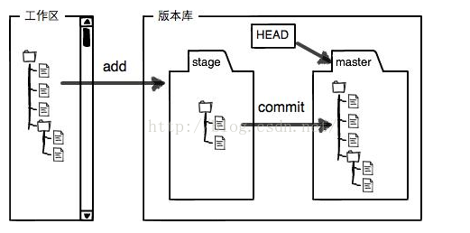

#VCS
**版本控制系统**（version control system） 记录文件内容变化，查阅特定版本修订情况的系统。用的比较多的是: SVN Git

## 分类
### 集中式版本控制系统
#### CVS
#### SVN
### 分布式版本控制系统
#### Git
```text
Git是一款开源分布式版本控制系统。
每个Git工作目录是一个带有完整历史记录和版本信息的仓库，不依赖于网络和中央服务器。
命令： https://git-scm.com/docs 
下载： https://git-scm.com/downloads
https://git-scm.com/book/zh/v2

可视化工具：
tortoisegit.org
download.tortoisegit.org/tgit

Git与SVN的区别：
1. Git是分布式版本控制系统
   SVN是集中式版本控制系统
   也就是说svn版本库是集中放在中央服务器的，而干活的时候，用的都是自己电脑，所以首先要从中央服务器那里得到最新版本，然后干活，干完后，需要把自己做完的活推送到中央服务器，并且必须联网才能干活；git没有中央服务器，每个人的电脑就是一个完整的版本库，这样工作的时候不需要联网，多个人协作工作只需把各自修改的文件推送给对方，就可以互相看到对方的修改。
2. Git把内容按元数据方式存储
   SVN按文件方式存储
3. Git本地和服务器端结构都很灵活，所有版本都存储在一个目录中，你只需要进行分支的切换即可达到在某个分支工作的效果
   SVN如果你需要在本地试验一些自己的代码，只能本地维护多个不同的拷贝，每个拷贝对应一个SVN服务器地址
4. Git可以本地提交代码，Git有利于将一个大任务分解，进行本地的多次提交
   SVN只能在本地进行大量的一次性更改，导致将来合并到主干上造成巨大的风险
5. Git的代码日志是在本地的，可以随时查看
   SVN的日志在服务器上的，每次查看日志需要先从服务器上下载下来。

```

##### Git初始配置
```text
点击按钮“Git Bash”或指定目录右击选择“Git Bash Here”
$ git config --global user.name  "jiaxiaojiao"
$ git config --global user.email "jiaxiaojiao@yahoo.com"
```

##### Eclipse配置Git用户名和邮箱（eclipse自带插件）

```text
Windows > preferences > Team > Git > Configuration
点击“Add Entry”输入用户名和密码，相当于git
$ git config --global user.name  "jiaxiaojiao"
$ git config --global user.email "jiaxiaojiao@yahoo.com"
```


##### 指定目录创建仓库
```text
$ git init
```

##### Git提交代码的五个步骤
```text
1. 查看代码的修改状态。（cd进入目标工程。 git status）
2. 查看代码的修改内容。（git diff <filename>  如果查看历史修改 git diff <hascode> <hashcode> <filename>）
3. 暂存需要提交的代码。（增加一个需要上传的文件 git add <filename>  删除一个不需要的文件 git rm <filename>  添加全部需要上传的文件 git add --all）
4. 提交已暂存的文件。（git commit    git commit -m <comment>  如果发现有文件漏提或注释有误，使用amend更正 git commit --amend）
5. 同步到服务器。（git push -u origin master）

注：
1. 同步到服务器前需要把服务器代码同步到本地。（git pull）
2. 如果执行失败，就按照提示还原有冲突的文件，然后再次尝试同步。（git checkout -- <有冲突的文件路径>）
3. 同步到服务器。（git puch origin <本地分支名>）
```



