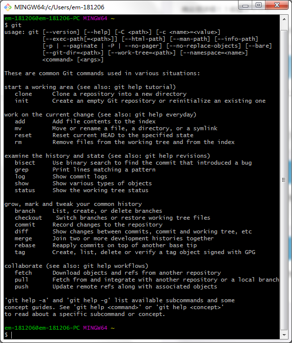

# 安装Git（Windows环境）

> 从Git官网下载安装程序

## 一、 下载
```text
地址：https://git-scm.com/download

文档：https://git-scm.com/book/zh/v2/

```

## 二、 安装（下一步、下一步……）

```text
> Select Components

> Use Git from Git Bash only

> 选择行结束符
Checkout Windows-style,commit Unix-style line endings

> 选择命令行窗口
Use MinTTY(the default terminal of MSYS2)

> 选择开启文件缓存
Enable file system caching

> Install
```

## 三、 安装成功

```text
    $ git
```

如图：


## 四、 配置全局用户名和邮箱

```text
    git config --global user.name  "jiaxiaojiao"
    git config --global user.email "jiaxiaojiao@yahoo.com"
    
```

## 五、 生成SSH秘钥对
> 很多服务器都是需要认证的，ssh认证是其中的一种。在客户端生成公钥，把公钥添加到服务器，这样以后连接服务器就不用每次都输入用户名和密码了。

```text
    ssh-keygen
    默认路径
    密码（可以为空）

```

## 使用

#### IDEA配置 git路径
```text
  > Settings 
  > Version Control 
  > Git 
  > Path to Git executable: C:\Program Files\Git\bin\git.exe
```