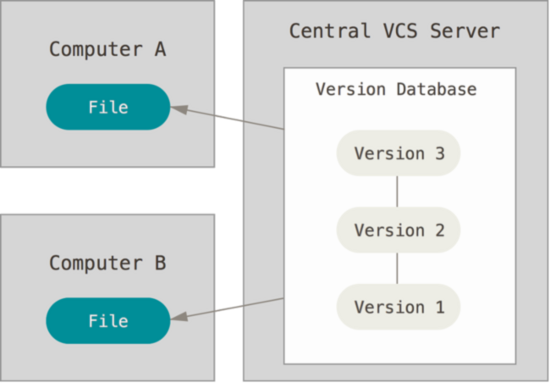
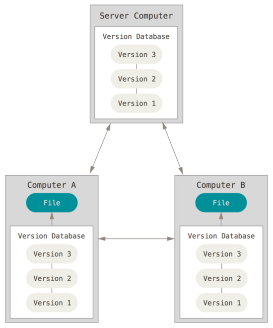

# 版本控制系统-分类

> 集中式版本控制系统
  分布式版本控制系统

## 集中式和分布式对比

#### 集中式特点：

- 只有一台中央服务器，存放着所有研发数据。
    
- 其它客户端机器上保存的是中央服务器最新版本的文件快照，不包括项目文件的变更历史。
    
- 需要从这台中央服务器同步最新版本,才能开始工作。

#### 集中式优点：

- 操作简单

- 文件夹级权限控制，权限控制粒度小

- 对客户端配置要求不高，无需存储全套代码

#### 集中式缺点：

- 网络环境要求高，相关人员必须联网才能工作

- 中央服务器的单点故障影响全局，如果服务器宕机，所有人都无法工作

- 中央服务器在没有备份的情况下，磁盘一旦被损坏，将丢失所有数据

#### 

#### 分布式特点：

- 每个客户端都是代码仓库的完整镜像，包括项目文件的变更历史。
    
- 所有数据分布的存储在每个客户端，不存在中央服务器。
    
- 所谓的“中央服务器”仅仅是用来方便管理多人协作。

#### 分布式优点：

- 版本库本地化，版本库的完整克隆，包括标签、分支、版本记录等

- 支持离线提交，适合跨地域协同开发

- 分支切换快速高效，创建和销毁分支廉价

#### 分布式缺点：

- 只能针对整个仓库创建分支，无法根据目录建立层次性的分支

- 不容易上手

#### 

